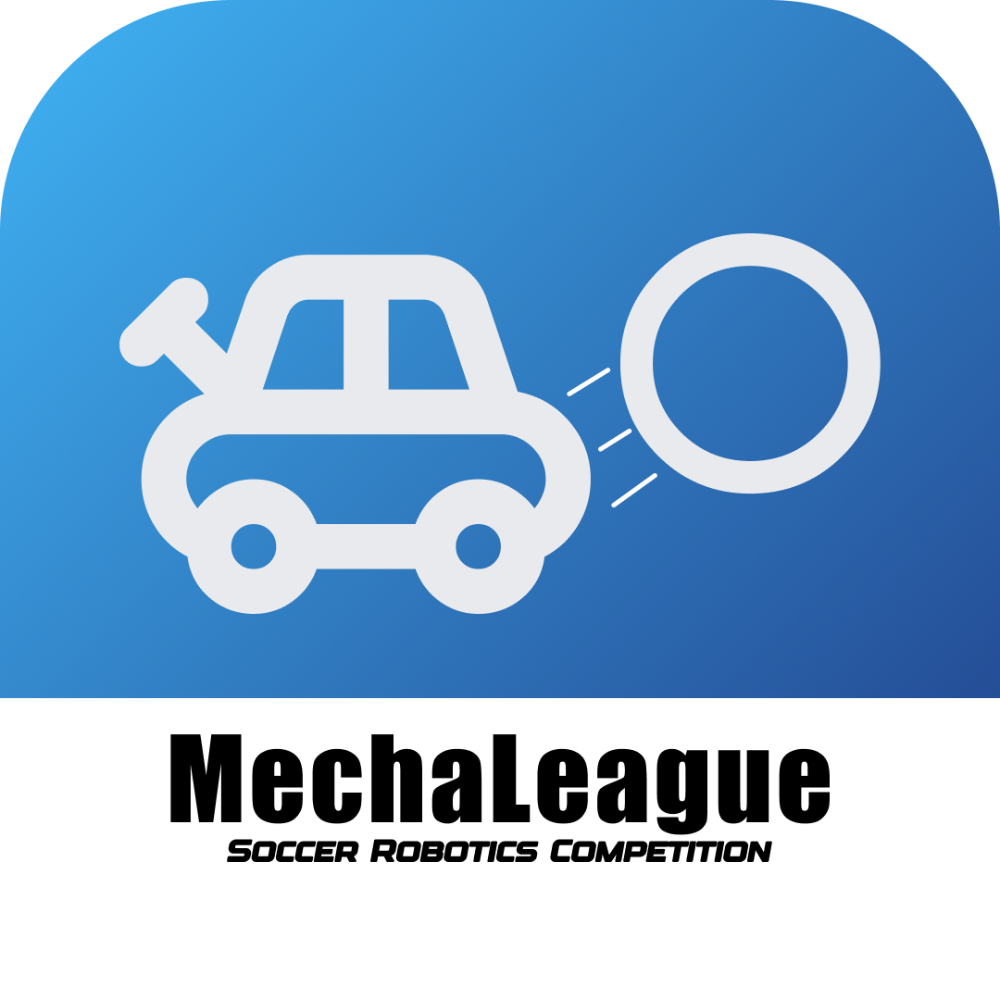

<h1 style="text-align: center;">
MechaLeague Robot
</h1>

The open source ESP32 and Arduino based robot platform for the Mecha League competition

Read the whitepaper here
https://www.figma.com/slides/AWmnqagFZSoyzxdnBp5D1x/MechaLeague-Robot-Whitepaper?node-id=1-266&t=clcfMGteuZ0O0do1-1

# Roadmap

## Onward
- Make this a more accessible competition
- Build a cheap starter-bot for anyone to join
- Make the code extremely easy to understand (more declarative)

## Current state
- Solved high battery consumption
- Implemented DRV8871s successfully for all motors
- Switched to a custom-build Power Distribution Board (looking to manufacture it as a PCB)
- Successfully implemented control with a PS5 Controller
- Started writing Mechalib for seamless control with all modules (Motor controllers, I2C Multiplexers and other IO) as well as field communication
- Started CAD and building mechanisms for the next season's starter bot

[You can browse the main code for this state of the project here](https://github.com/ramondeleonca/MechaLeague-Bot/blob/fa9dd77d7594459f29f9386272432d25a3bafdb5/src/impl/tests/ps5_mecanum/ps5.h)

## December 2024
- Solve high battery consumption
- Control the robot using only the ESP32
- Use a gamepad instead of RemoteXY
- Use more powerful DRV8871 motor controllers
- Implement encoders for odometry and more accurate control
- Implement gyroscopes and accelerometers
- Use a more well-suited power distribution board

[You can browse the main code for this state of the project here](https://github.com/ramondeleonca/MechaLeague-Bot/blob/fa9dd77d7594459f29f9386272432d25a3bafdb5/src/impl/tests/ps5_mecanum/ps5.h)

## November 2024
- Get the original Arduino with an L293D driver shield controlling the robot
- Make this control modular (allow other MCUs to control it over UART)
- Calculate the correct wheel speeds using **Mecanum Drive Kinematics**
- Make an ESP32 use this control interface (UART)
- Build some code to drive it using [RemoteXY](https://remotexy.com/) (mobile phone app control)

[You can browse the main code for this state of the project here](https://github.com/ramondeleonca/MechaLeague-Bot/blob/403864bea0e7e071c8703e8508ac226923234764/src/impl/tests/remotexy/remotexy.h)